 

## Features

#### Record data or print reports of the apartment building finances.  
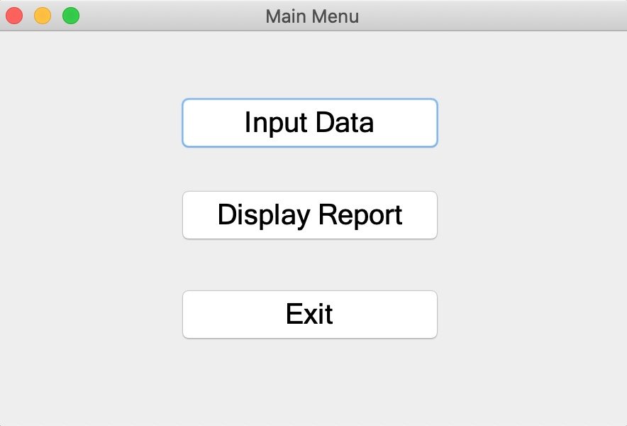  
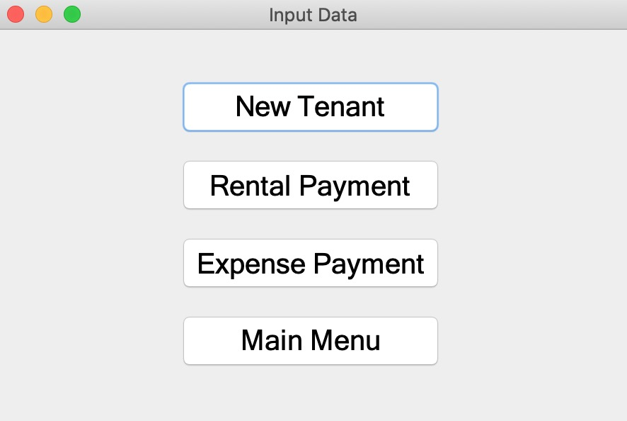  
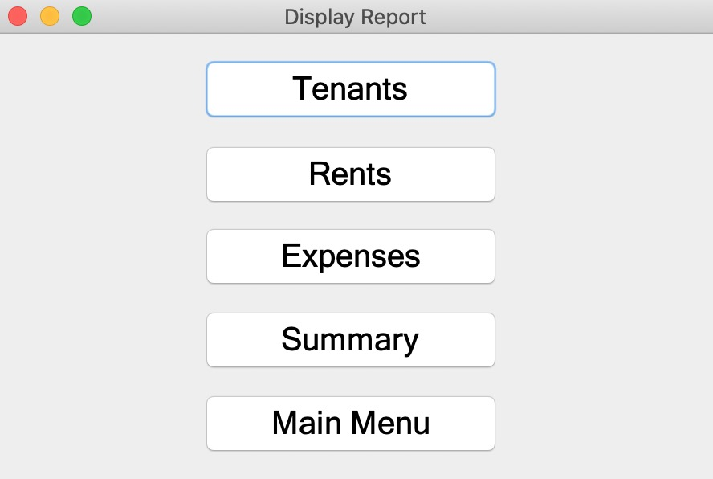  
#### Display a list of tenants living in the apartment building.  
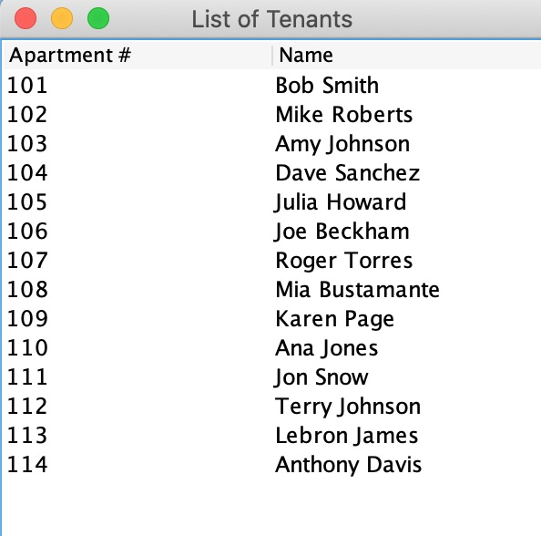  
#### Display an income report of the rental payments from the tenants.  
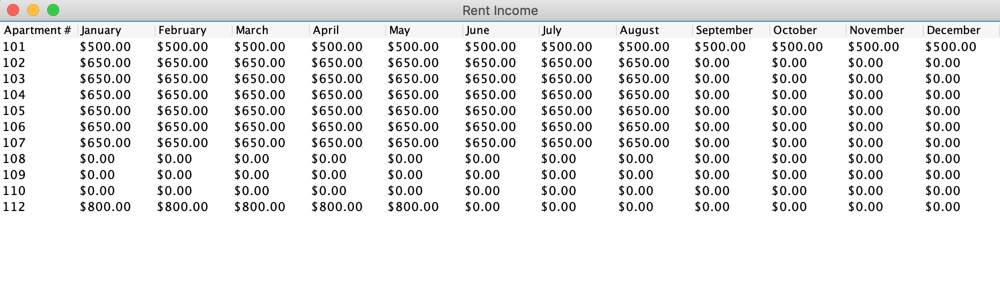  
#### Display an expense report with the expense payment categories.  
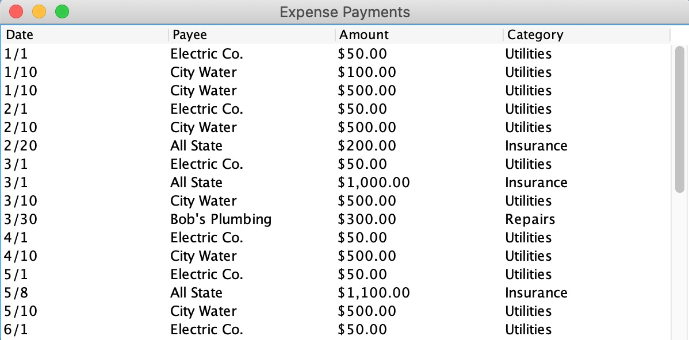  
#### Display an annual summary report of the apartment building finances.  
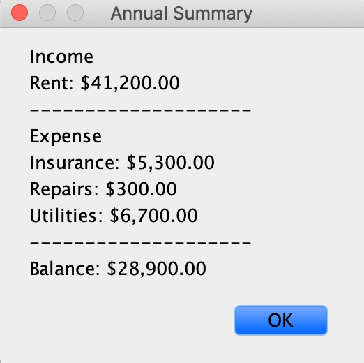  
#### Add a new tenant to the apartment building ledger.  
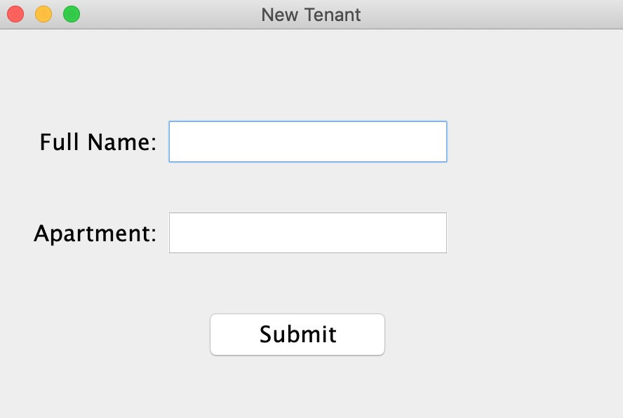  
#### Record incoming rent payments from tenants.  
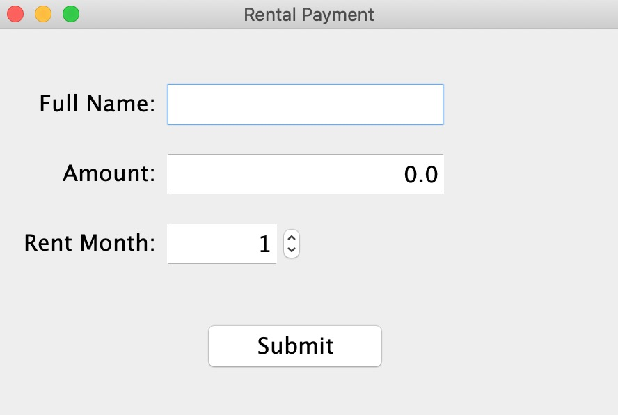  
#### Record expense payments and specify budget categories.  
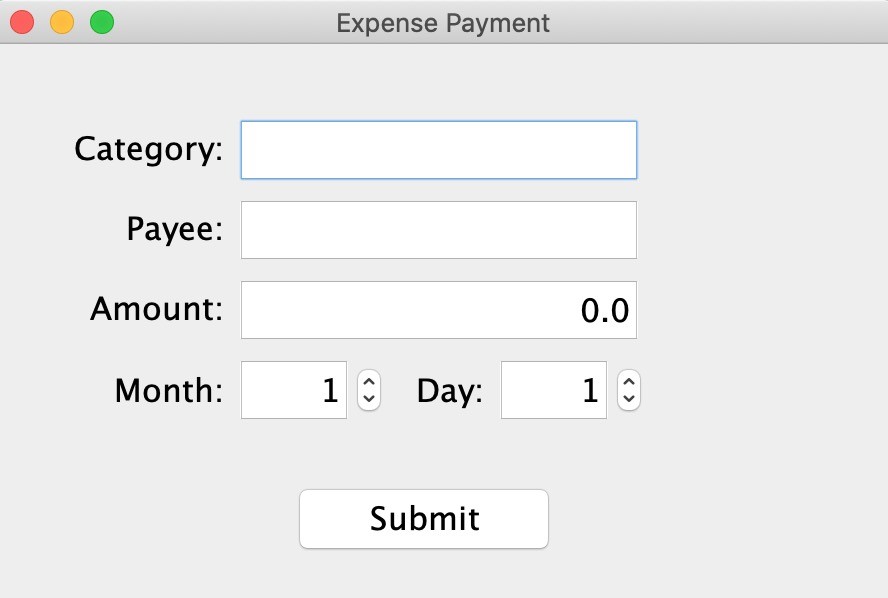


## Technologies

Project was created with:
* [Java SE 14](https://www.oracle.com/java/technologies/javase-jdk14-downloads.html) - JDK version 14.0.1
* [JUnit 5](https://junit.org/junit5/) - Jupiter version 5.6.2
* [Eclipse](https://www.eclipse.org/downloads/) - IDE version 2020-06


## Installing

To clone this repository to your desktop, you will need to have Git installed on your computer. From your command line, clone this repository:
```
git clone https://github.com/jerrybelmonte/The-Innkeeper.git
```
Verify that the installation process was successful. Navigate into the repository:
```
cd The-Innkeeper/
```


## How To Use

### MacOSX
If you are using a Mac, run the following terminal command from within the repository:
```
java -jar InnKeeperDemo.jar
```

### Windows 10
If you are using a Windows 10 computer, start the program by:
```
Double-clicking > InnKeeperDemo.jar
```
_Note:_ At the start of the program a login screen pops up.  
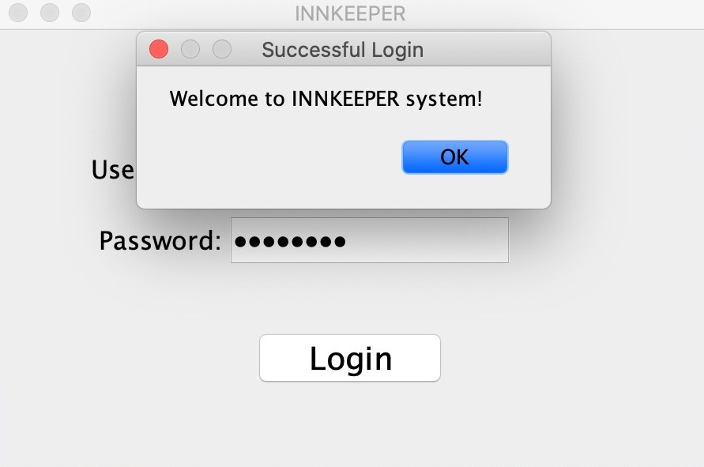


## Authors

* **Jerry Belmonte** - https://github.com/jerrybelmonte
* **Kate Nguyen** - https://github.com/hoantk2612
* **Sirage El-Jawhari** - https://github.com/SergeJawhari
* **Howard Moon** - https://github.com/howardmn


## License

This project is licensed under the terms of the **MIT** license. See the [LICENSE.md](LICENSE.md) file for details.
